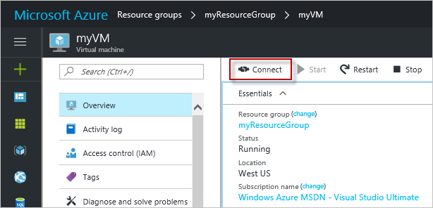
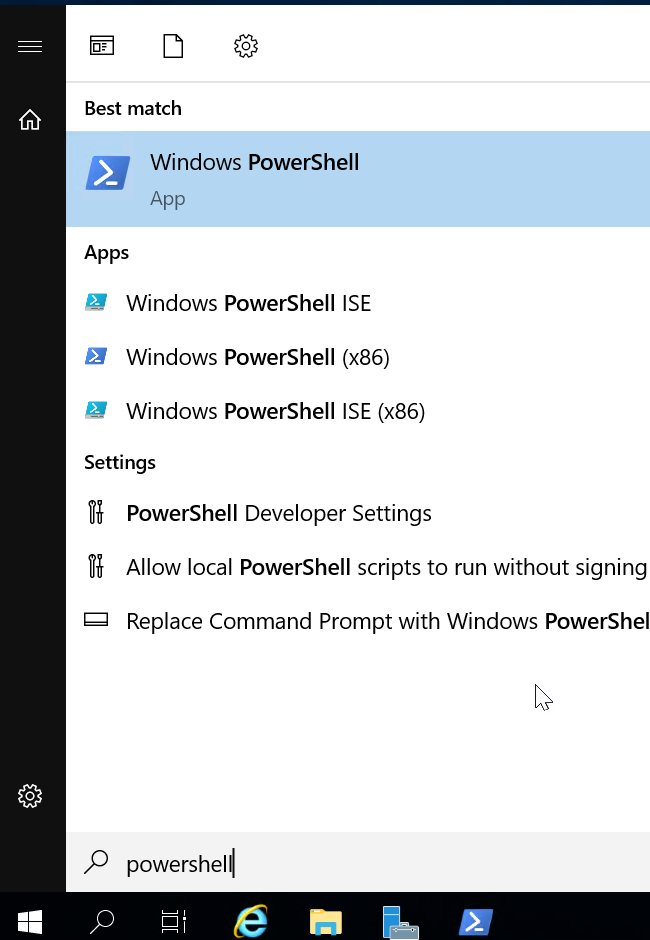
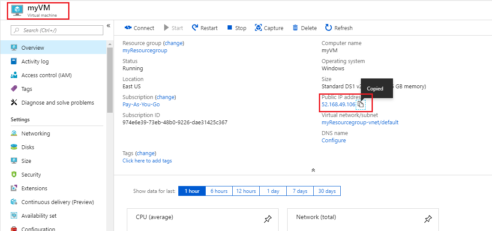

---
wts:
    Título: '01 - Crear una máquina virtual en el portal'
    Módulo: 'Módulo 02 - Servicios principales de Azure'
---
# 01 - Crear una máquina virtual en el portal

En este tutorial, crearemos una máquina virtual en Azure Portal, conectaremos a la máquina virtual, instalaremos el rol de servidor web y probaremos.

**Nota**: Tómese el tiempo durante este paso para hacer clic y leer los iconos informativos.

# Tarea 1: Crear la máquina virtual

En esta tarea, crearemos una máquina virtual Windows Server 2019 Datacenter - Gen1. 

1. Inicie sesión en el [Portal de Azure (https://portal.azure.com)](https://portal.azure.com?azure-portal=true).

2. En la hoja **Todos los servicios**, busque y seleccione **Máquinas virtuales** y, a continuación, haga clic en **+ Agregar** y elija **+Máquina virtual**.

3. En la pestaña **Básicos**, rellene la siguiente información (deje los valores predeterminados para todo lo demás):

    | Configuración | Valores |
    |  -- | -- |
    | Suscripción | **Elige tu suscripción**|
    | Grupo de recursos | **CREHANA-RG-VM** (Crear nuevo) |
    | Nombre de la máquina virtual | **SRV-APP-01** |
    | Opciones de disponibilidad | No se requiere redundancia de la infraestructura |
    | Instancia de Azure Spot o acceso puntual| Seleccionar **No** |
    | Región | **(US) Este de EE.UU**|
    | Imagen | **Windows Server 2019 Datacenter - Gen1**|
    | Tamaño | Standard_D2s_v4|
    | Nombre de usuario de la cuenta de administrador | **Administrador** |
    | Contraseña de la cuenta de administrador | **Cr3h4n42020**|
    | Confirmar contraseña de la cuenta de administrador | **Cr3h4n42020.**|
    | Reglas de puertos de entrada- Seleccionar permitir los puertos seleccionados | **RDP (3389)** and **HTTP (80)**|
    | Licencias | Seleccionar **No**|
    | | |

4. Cambie a la pestaña Redes, y busque **Seleccionar puertos de entrada (Inboud)*:

    | Configuración | Valores |
    | -- | -- |
    | Seleccionar puertos de entrada (Inboud) | **HTTP (80), RDP (3389)**|
    | | |

5. Cambie a la pestaña Administración, y en la sección **Supervisión**, seleccione la siguiente configuración:

    | Configuración | Valores |
    | -- | -- |
    | Diagnósticos de arranque | **Habilitar con la cuenta de almacenamiento administrada (recomendado)*|
    | | |

6. Deje los valores predeterminados restantes y, a continuación, haga clic en el botón **Revisar y crear** en la parte inferior de la página.

7. Una vez que se pasa la validación, haga clic en el botón **Crear**. La implementación de la máquina virtual puede tardar entre cinco y siete minutos.

8. Recibirá actualizaciones de la implementación de cada uno de los recursos subayacentes en la página de implementación y a través del área **Notificaciones** (el icono de campana ubicado en el costado derecho del menú superior).

# Tarea 2: Conéctese a la máquina virtual

En esta tarea, nos conectaremos a nuestra nueva máquina virtual mediante RDP.

1. Dírijase al área de búsqueda uBicada en la parte superior del portal de Azure y seleccione la nueva máquina virtual **SRV-APP-01** .

    **Nota**: También puede usar el vínculo **Ir aL recurso** en la página de implementación o a través del área de **Notificaciones**.

2. En la página de **Información general** de su máquina virtual, haga clic en el botón **Conectar** y elija **RDP**..

    

    **Note**: The following directions tell you how to connect to your VM from a Windows computer. On a Mac, you need an RDP client such as this Remote Desktop Client from the Mac App Store and on a Linux computer you can use an open source RDP client.

2. In the **Connect to virtual machine** page, keep the default options to connect with the public IP address over port 3389 and click **Download RDP File**.

3. **Open** the downloaded RDP file and click **Connect** when prompted. 

    

4. In the **Windows Security** window, select **More choices** and then **Use a different account**. Provide the username (.\azureuser) and the password (Pa$$w0rd1234). Click **OK** to connect.

    

5. You may receive a certificate warning during the sign-in process. Click **Yes** or to create the connection and connect to your deployed VM. You should connect successfully.

    

Congratulations! You have deployed and connected to a Windows Server virtual machine in Azure

# Task 3: Install the web server role and test

In this task, install the Web Server role on the server and ensure the default IIS welcome page can be displayed.

1. Open up a PowerShell command prompt on the virtual machine, by clicking the **Start** button, typing **PowerShell**, right clicking **Windows PowerShell**, and selecting **Run as administrator** in the right-click menu.

    

2. Install the **Web-Server** feature in the virtual machine by running the following command in the PowerShell command prompt. You can copy and paste this command.

    ```PowerShell
    Install-WindowsFeature -name Web-Server -IncludeManagementTools
    ```
  
3. When completed there will be a prompt stating **Success** with a value **True**. You do not need to restart the virtual machine to complete the installation. Close the RDP connection to the VM.

    

4. Back in the portal, navigate back to the **Overview** blade of myVM and, use the **Click to clipboard** button to copy the public IP address of myVM, open a new browser tab, paste the public IP address into the URL text box, and press the **Enter** key to browse to it.

    

5. The default IIS Web Server welcome page will open.

    

Congratulations! You have created a web server that is accessible via its public IP address. If you had a web application to host, you could deploy application files to the virtual machine and host them for public access on the deployed virtual machine.


**Note**: To avoid additional costs, you can remove this resource group. Search for resource groups, click your resource group, and then click **Delete resource group**. Verify the name of the resource group and then click **Delete**. Monitor the **Notifications** to see verify that the deletion completed successfully. 
