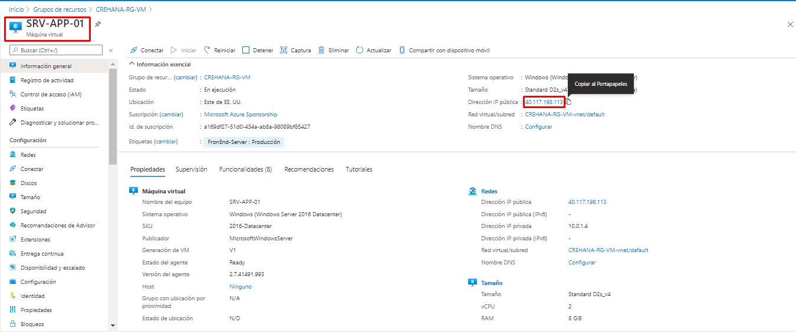

---
wts:
    Título: '01 - Crear una máquina virtual en el portal'
    Módulo: 'Módulo 02 - Servicios principales de Azure'
---
# 01 - Crear una máquina virtual en el portal

En este tutorial, crearemos una máquina virtual en Azure Portal, conectaremos a la máquina virtual, instalaremos el rol de servidor web y probaremos.

**Nota**: Tómese el tiempo durante este paso para hacer clic y leer los iconos informativos.

# Tarea 1: Crear la máquina virtual

En esta tarea, crearemos una máquina virtual Windows Server 2019 Datacenter - Gen1. 

1. Inicie sesión en el [Portal de Azure (https://portal.azure.com)](https://portal.azure.com?azure-portal=true).

2. En la hoja **Todos los servicios**, busque y seleccione **Máquinas virtuales** y, a continuación, haga clic en **+ Agregar** y elija **+Máquina virtual**.

3. En la pestaña **Básicos**, rellene la siguiente información (deje los valores predeterminados para todo lo demás):

    | Configuración | Valores |
    |  -- | -- |
    | Suscripción | **Elige tú suscripción**|
    | Grupo de recursos | **CREHANA-RG-VM** (Crear nuevo) |
    | Nombre de la máquina virtual | **SRV-APP-01** |
    | Opciones de disponibilidad | No se requiere redundancia de la infraestructura |
    | Instancia de Azure Spot o acceso puntual| Seleccionar **No** |
    | Región | **(US) Este de EE.UU**|
    | Imagen | **Windows Server 2019 Datacenter - Gen1**|
    | Tamaño | Standard_D2s_v4|
    | Nombre de usuario de la cuenta de administrador | **Administrador** |
    | Contraseña de la cuenta de administrador | **Cr3h4n42020.**|
    | Confirmar contraseña de la cuenta de administrador | **Cr3h4n42020.**|
    | Reglas de puertos de entrada- Seleccionar permitir los puertos seleccionados | **RDP (3389)** and **HTTP (80)**|
    | Licencias | Seleccionar **No**|
    | | |

4. Cambie a la pestaña Redes, y busque **Seleccionar puertos de entrada (Inbound)**:

    | Configuración | Valores |
    | -- | -- |
    | Seleccionar puertos de entrada | **HTTP (80), RDP (3389)**|
    | | |

5. Cambie a la pestaña Administración, y en la sección **Supervisión**, seleccione la siguiente configuración:

    | Configuración | Valores |
    | -- | -- |
    | Diagnósticos de arranque | *Habilitar con la cuenta de almacenamiento administrada (recomendado)*|
    | | |

6. Cambie a la pestaña Etiquetas, y realice la siguiente configuración:

    | Nombre | Valor | Recurso |
    | -- | -- | -- |
    | FronEnd-Server | Producción | 12 seleccionados |
    | | | |

 **Nota**: Deje los valores restantes como predeterminados y, a continuación, haga clic en el botón **Revisar y crear** en la parte inferior de la página.

7. Una vez que se pasa la validación, haga clic en el botón **Crear**. La implementación de la máquina virtual puede tardar entre cinco y siete minutos.

8. Recibirá actualizaciones de la implementación de cada uno de los recursos subayacentes en la página de implementación y a través del área **Notificaciones** (el icono de campana ubicado en el costado derecho del menú superior).

# Tarea 2: Conéctese a la máquina virtual

En esta tarea, nos conectaremos a nuestra nueva máquina virtual mediante RDP.

1. Dírijase al área de búsqueda uBicada en la parte superior del portal de Azure y seleccione la nueva máquina virtual **SRV-APP-01** .

    **Nota**: También puede usar el vínculo **Ir aL recurso** en la página de implementación o a través del área de **Notificaciones**.

2. En la página de **Información general** de su máquina virtual, haga clic en el botón **Conectar** y elija **RDP**..

    

    **Nota**: Las siguientes instrucciones le indican cómo conectarse a la máquina virtual desde un equipo Windows. En un equipo Mac, necesita un cliente de escritorio remoto o RDP el cual puede adquirirse desde Mac App Store y en un equipo Linux puede usar un cliente RDP de código abierto.

2. En la pestaña **Conectae a la máquina virtual**, mantenga las opciones predeterminadas para conectarse con la dirección IP pública a través del puerto 3389 y haga clic en **Descargar archivo RDP**.

3. **Abra** el archivo RDP descargado y haga clic en **Conectar** cuando se le solicite.

    

4. En la ventana Seguridad de Windows, seleccione **Más opciones** y, a continuación seleccione, **Usar una cuenta diferente**. Proporcione el nombre de usuario (**.\Administrador**) y la contraseña (**Cr3h4n42020.**). Haga clic en **Aceptar** para conectarse.

    

5. Puede recibir una advertencia de certificado durante el proceso de inicio de sesión. Haga clic en **Sí** para crear la conexión y conectarse a la máquina virtual implementada. Una vez realizado esto, debería conectarse correctamente.

    

¡Felicitaciones! Usted ha implementado y se ha conectado a una máquina virtual de Windows Server alojada en los datacenter de Microsoft Azure

# Tarea 3: Instale el rol de servidor web y verifique 

En esta tarea, instale el rol de servidor web en el servidor implementado anteriormente y asegúrese de que se puede mostrar la página de bienvenida predeterminada de Internet Information Services (IIS) .

1. Abra un símbolo del sistema de PowerShell en la máquina virtual, haciendo clic en el botón Inicio, escribiendo **PowerShell**, haciendo clic con el botón derecho en **Windows PowerShell** y seleccionando **Ejecutar como administrador** en el menú contextual.

    

2. Instale la característica **Servidor web** en la máquina virtual ejecutando el siguiente comando en el símbolo del sistema de PowerShell. Puede copiar y pegar este comando.

    ```PowerShell
    Install-WindowsFeature -name Web-Server -IncludeManagementTools
    ```
  
3. Cuando se completela instrucción anterior, habrá un mensaje que indica **Success** con un valor **True** indicando que la característica de **Web Server** ha sido instalada con éxito. No es necesario reiniciar la máquina virtual para completar la instalación. Si desea puede cerrar la conexión RDP de la máquina virtual.

    

4. De vuelta en el portal de Azure, vuelva a la sección **Información general** de SRV-APP-01 y, utilice el botón **copiar al portapapeles** para copiar la dirección IP pública de SRV-APP-01, abra una nueva pestaña del explorador, pegue la dirección IP pública en el cuadro de texto URL y presione la tecla **Enter** para proceder con la úsqueda.

    

5. Se abrirá la página de bienvenida predeterminada del servidor Web IIS.

    

¡Felicitaciones! Ha creado un servidor web al que se puede acceder a través de internet con su dirección IP pública. Si tiene una aplicación web para hospedar, podría implementar los archivos de la aplicación en esta máquina virtual y de esta manera permitir su acceso a través de internet.


**Nota**: Para evitar costos adicionales, puede eliminar este grupo de recursos. Busque grupos de recursos, haga clic en el grupo de recursos y, a continuación, haga clic en **Eliminar grupo de recursos**. Compruebe el nombre del grupo de recursos **CREHANA-RG-VM** y, a continuación, haga clic en **Eliminar**. Supervise las **notificaciones** para asegurarse que la eliminación se ha completado correctamente.
